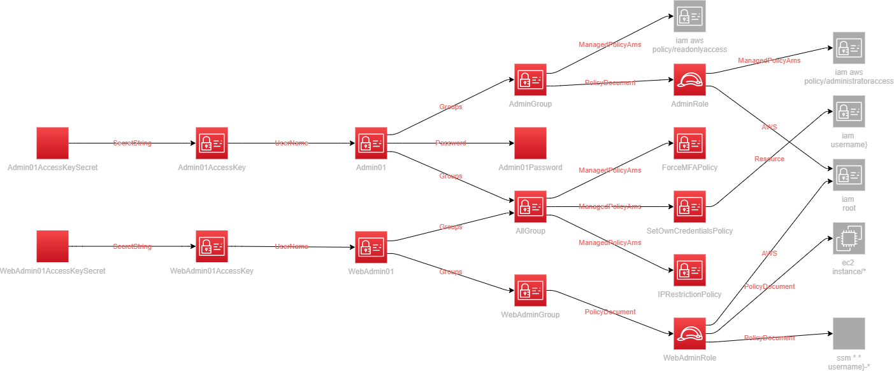
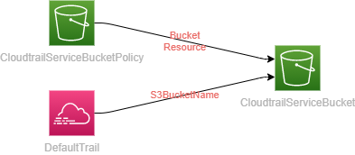

Cloudformation CI/CD example
============================

[](https://github.com/codequokka/cloudformation-cicd-example/actions/workflows/check.yml)
[](https://github.com/codequokka/cloudformation-cicd-example/actions/workflows/deploy.yml)

## An example of AWS cloudfomation CI/CD with Github Actions

Templates
---------
### Overview
|Template|Stack|Description|Deploy method|
|--------|-----|-----------|-------------|
|[initial.yml](cfn/templates/initial.yml)|InitialStack|Create a role for Github Actions CD.|Manual|
|[iam.yml](cfn/templates/iam.yml)|IAMStack|Create IAM users.|Manual|
|[kms.yml](cfn/templates/kms.yml)|KMSStack|Create the key for common usage.|Github Actions|
|[config.yml](cfn/templates/config.yml)|ConfigStack|Enable Config service.|Github Actions
|[cloudtrail.yml](cfn/templates/cloudtrail.yml)|CloudtrailStack|Enable Cloudtrail service.|Github Actions
|[guardduty.yml](cfn/templates/guardduty.yml)|GuarddutyStack|Enable Guardduty service.|Github Actions
|[vpc.yml](cfn/templates/vpc.yml)|VPCStack|Create network related resources(VPC, IGW, Subnets, Routetables, EIP, NATGW).|Github Actions
|[ec2.yml](cfn/templates/ec2.yml)|EC2Stack|Create EC2 instances.|Github Actions
|[ssm-patchmanager.yml](cfn/templates/ssm-patchmanager.yml)|SSMPatchmanagerStack|Enable SSM Patch manager.|Github Actions|


### Resouces created by templates
- initial.yml  


- iam.yml  


- kms.yml  


- config.yml  


- cloudtrail.yml  


- guardduty.yml  


- vpc.yml  


- ec2.yml  


- ssm-patchmanager.yml  


Usage
-----
### Before starting CI/CD
- Deploy the initial.yml template manually to create an IAM role to deploy templates by Github Actions.
```
$ aws cloudformation deploy --stack-name InitialStack --template-file cfn/templates/initial.yml 
```
- Set Github Actions secrets AWS_ACCOUNTID to your account id(Ex. 123456789012)

### CI
- Check templates with cfn-lint, cfn-nag by Github Actions.[(check.yml)](.github/workflows/check.yml)
- When you push a commit to a branch other than the master branch, Github Actions will run cfn-lint, cfn-nag against the templates.
- Click a button to show the check workflow results.
[](https://github.com/codequokka/cloudformation-cicd-example/actions/workflows/check.yml)

### CD
- Deploy templates to your AWS environment by Github Actions.[(deploy.yml)](.github/workflows/deploy.yml)
- When you commit to the master branch or merge a pull request into the master branch, Github Actions will apply the templates.
- Click a button to show the deploy workflow results.
[](https://github.com/codequokka/cloudformation-cicd-example/actions/workflows/deploy.yml)